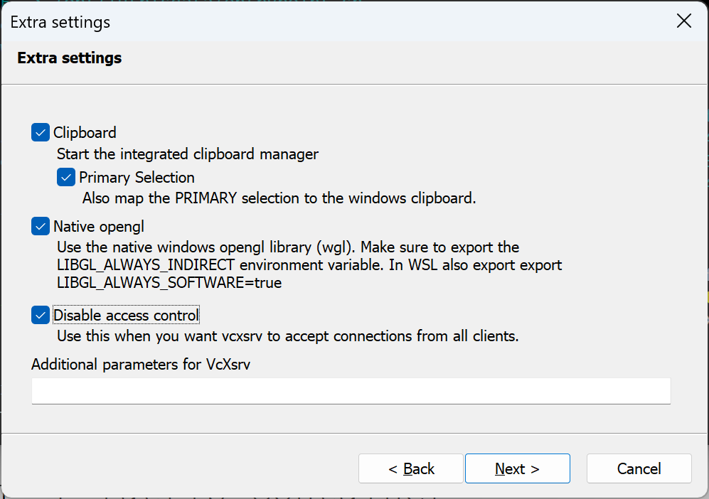
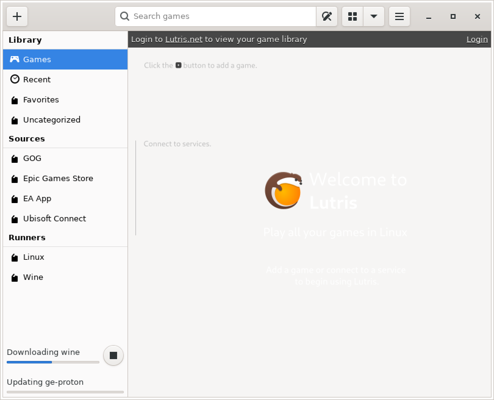

# Prerequisites
[Windows X-server](https://github.com/marchaesen/vcxsrv)


# Build
```
docker build --platform linux/amd64 -t wine-tkg-lutris "C:\Docker\Lutris"
```

# Run Lutris
1. Run this in pwsh or cmd:
```
docker run -it -e DISPLAY=host.docker.internal:0 -v /tmp/.X11-unix:/tmp/.X11-unix -v C:\Docker\Lutris\Wine:/data/wine -v lutris-wine-data:/home/lutrisuser wine-tkg-lutris
```
2. Wait for wine updates to process.

3. Click the + in the upper right corner and `Install from a local install script`.
4. Click through the next screens and install missing packages (`wine-mono` is for Windows compatibility).

# Debugging Command Line
```
docker run -it -e DISPLAY=host.docker.internal:0 -v /tmp/.X11-unix:/tmp/.X11-unix -v C:\Docker\Lutris\Wine:/data/wine -v lutris-wine-data:/home/lutrisuser wine-tkg-lutris /bin/bash
```

# Uninstall
```
# Stop and remove containers using the Lutris image
$containers = docker ps -a --filter "ancestor=wine-tkg-lutris" --format "{{.ID}}"
if ($containers) {
    docker stop $containers
    docker rm $containers
}

# Remove the Lutris image
docker rmi wine-tkg-lutris --force

# Remove the specific Lutris volume
docker volume rm lutris-wine-data -f

# Remove the local project folder
Remove-Item -Recurse -Force "C:\Docker\Lutris"
```
